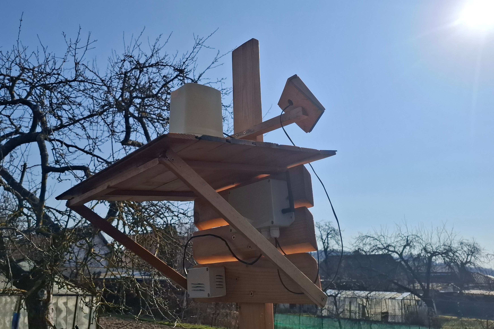
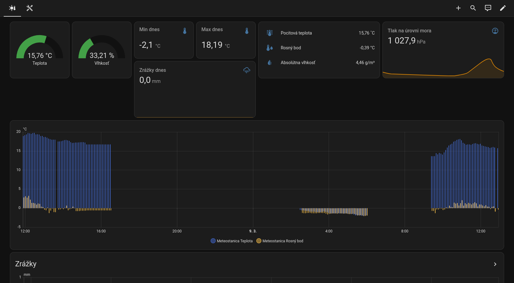
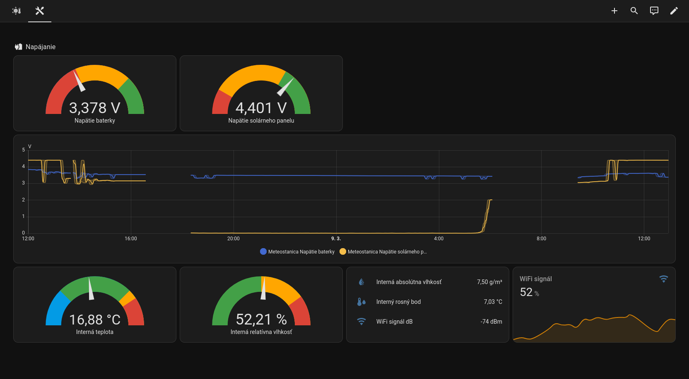
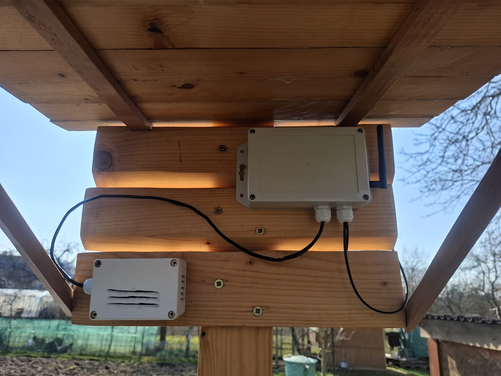
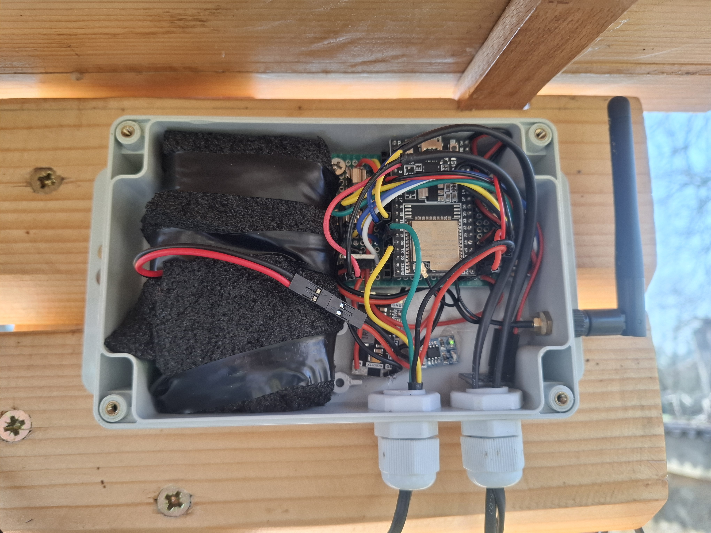
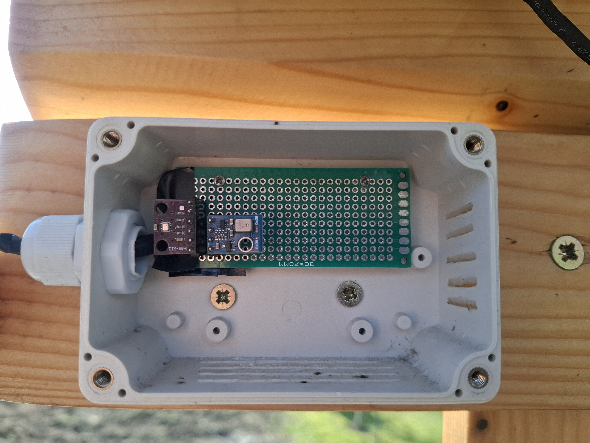

# Weather station

[meteostanica.yaml](meteostanica.yml) - ESPHome config

This is an ESP32-powered weather station built using [ESPHome](https://esphome.io/)
with several sensors measuring the following data:

- AHT10:
  - Temperature
  - Relative humidity
- BMP280:
  - Atmospheric pressure
- Rain gauge (from an old broken weather station):
  - Precipitation
- ADS1115:
  - Battery voltage
  - Solar panel voltage

Using these measurements, additional values can be calculated:

- Absolute humidity
- Feels-like temperature (basic calculation using temperature and humidity)
- Dew point
- Sea level pressure

The AHT10 and BMP280 sensors are placed in a separate box with ventilation holes
to provide more accurate measurements. This keeps the rest of the electronics
fully enclosed and protected from the elements.

A second AHT10 sensor measures temperature and humidity inside the main control
box. Together with the voltage measurements, these are classified as diagnostic
data so they are not automatically added to Home Assistant dashboards. I made
two simple custom dashboards: one for weather data and another for diagnostics
(optimized for mobile view).

Weather dashboard

Diagnostics dashboard

## Power

The weather station is powered by a combination of a battery and a solar panel.
Three 18650 cells were salvaged from an old unused laptop and connected in parallel.

The battery alone can power the device for about 7–8 days. During sunny days the
solar panel produces enough power to run the station and recharge the battery.
During the summer of 2025, the system ran for 38 days without interruption.

A simple power-path design is used to avoid drawing power from the battery during
the day while the solar panel is producing electricity. This is implemented with
a MOSFET controlled by the solar panel: when the panel produces power, the battery
is disconnected from the voltage converter (XL63070) and the converter is powered
directly from the solar panel. The panel is also connected to a solar charger
(SDO5CRMA – similar to the well-known TP4056 but with MPPT support to optimize
power production from unstable sources such as solar panels).

Battery life could be significantly improved by using deep sleep. However, the
ESP32 needs to stay awake to count pulses from the rain gauge (and potentially
a wind gauge in the future).

## Rain gauge

The rain gauge was salvaged from an old broken weather station. The internal
electronics were removed and wires were soldered directly to the reed switch.
ESPHome's pulse counter component is used to count the ticks.

By pouring water through the rain gauge and measuring the result, it was
determined that one tick corresponds to 0.27 mm of rainfall per square meter.
The total rainfall is therefore calculated by multiplying the number of ticks
by 0.27.

In Home Assistant, the [utility meter](https://www.home-assistant.io/integrations/utility_meter)
helper is used to display rainfall per hour and per day.

## Future plans

The original weather station also included sensors for measuring wind speed and
direction, and the remaining electronics could potentially be reused to add wind
measurement.

Since building this project, I started 3D printing and learning 3D modeling.
My plan is to design and print a custom wind gauge using ASA filament for
better weather resistance.

## Photos

